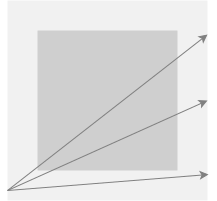
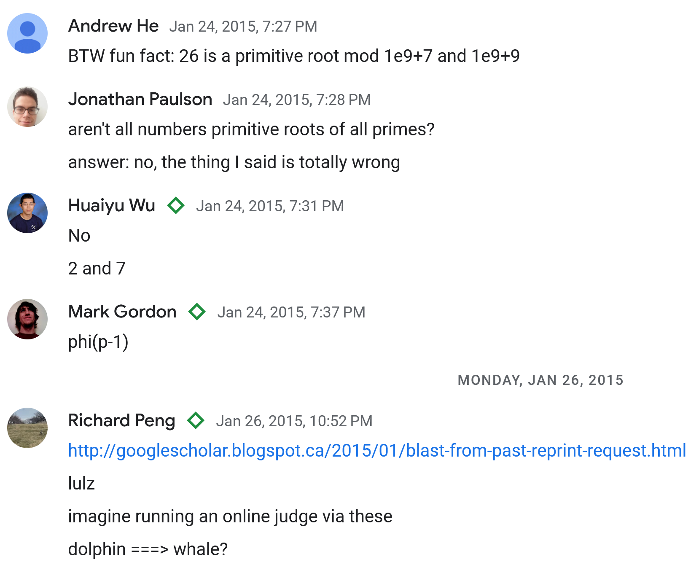

<!-- emilia-snapshot-properties
UAPC 2023 Retrospective
2023/03/16

emilia-snapshot-properties -->

# UAPC 2023 retrospective

March 16, 2023
Yang Yan

We placed 10th on the [UAPC 2023](https://codeforces.com/blog/entry/113620) open division [standings](https://uapc23open.kattis.com/contests/uapc23open/standings) and failed the VTuber community as a result. I write this retrospective in reparation.

*My inbox is open for qualified suitors, Melinda.*

While Isometric and Scout did not join me until the final of four hours, my blunder was failing to focus in the latter half to solve K, and spending too long, too early, on E. In addition, I was too lax about time and resubmission penalty, as I had assumed I would be the sole team to AK, and decided incorrectly to solve everything in order.

I present terse solutions and thoughts on all the problems. My submissions are archived at [altair](https://github.com/GilgameshxZero/altair/tree/master/kattis/uapc2023open).

1. [\[Trivial\] A | B | C | I | J](#1-trivial-a--b--c--i--j)
2. [\[Observation\] D | F](#2-observation-d--f)
3. [\[Classic\] G | H | M | N](#3-classic-g--h--m--n)
4. [\[Geometry\] E: Maddison's Square Garden](#4-geometry-e-maddisons-square-garden)
5. [L: Sneaky Exploration](#5-l-sneaky-exploration)
6. [K: Central String](#6-k-central-string)
7. [Retrospective](#7-retrospective)

## 1 [Trivial] A | B | C | I | J

The only notable problem here is I, a simulation problem. However, proper knowledge of standard library runtimes should render this straightforward.

## 2 [Observation] D | F

I spend too long making observations on this type of problem. On the flip side, it seems quite easy to get these observations wrong.

### D: Lefties vs. Righties

For D, topics are either coverable by only L-experts, or only R-experts, or both. Let $l,r$ represent the number of topics in the former two sets, and WLOG let $l\geq r$. Denote by $l',r'$ the remaining experts of each type after picking $1$ expert for each of the $l+r$ topics. We must pick at least $l-r$ additional R-experts, so the input is unsolvable iff $r'<l-r$.

If $l\geq\lceil T/2\rceil$, there is no need to pick any additional L-experts. We can always pick R-experts for the uncovered topics, so the answer is $2l$ in this case. Otherwise, $l<\lceil T/2\rceil$, and the smallest possible answer is $2\lceil T/2\rceil$. We can always pick enough experts on both sides for this solution, since the uncovered topics must have at least one expert on either side.

### F: Graduation Table

For F, each connected component of the graph is either a cycle or a path, due to the requirement that each node has degree at most $2$. This was nonobvious to me, but in hindsight a degree of at least $3$ is required for any “forking”. All edges along a path may be satisfied by sitting the nodes together. All edges in a cycle may be satisfied iff it is the only connected component in the graph and we may sit them in a cycle. To determine the unique set of edges per component, I floodfilled with a `set`. Alternatives seem slightly tricky; deduping the edges connected to the initial floodfill node in a cycle is nonobvious to me.

The problem limits are $M\leq N\leq 5e3$, which could have been higher. I was briefly mislead by this toward more complex solutions.

## 3 [Classic] G | H | M | N

These four problems are all solved with fairly obvious standard techniques.

### G: Mirror Strings

Strings must be palindromes, and must consist of only one height of letters. Palindromes of length $N$ have $X=\lceil N/2\rceil$ choices of letters. There are $5$ tall letters and $2$ short letters. Hence, we sum $5^X+2^X$ for $L\leq N\leq R$.

### H: Alien Math

This is reminiscent of [Huffman codes](https://en.wikipedia.org/wiki/Huffman_coding). Build a trie and walk it, adjusting the answer and resetting at each leaf.

### M: Precarious Stacks

This is a lazy segtree problem with coordinate compression.

Ian also hints at a solution without segtrees. We do this by tracking in a BBST the intervals with the same height, and their height. At each block, we iterate through all intervals which intersect its horizontal range to compute the height at which it settles. Each such block increases the set of intervals by at most $2$. Should we iterate over $X+2$ intervals in one step, we must delete at least $X$ of them as they are now covered by the new block. Hence, there are at most $O(N)$ interval insertions and deletions.

At the same time, we may track in a priority queue the heights of each interval, and output the max element after each block. Similar to the segtree solution, this is $O(N\lg N)$.

### N: Shopping Bags

With no more than $4$ of the second item fitting into one bag, this is a standard DP to compute the $M_{i,j}$, the minimum number of bags to fit $i$ of the first item and $j$ of the second. For transitions, we put as many items as possible into a new bag. Thus,

$$M_{i,j}=\min_{kS_2\leq T} 1+M_{i-\lfloor (T-kS_2)/S_1\rfloor,j-k}.$$

I failed my initial submission as I miscomputed $\lfloor (T-kS_2)/S_1\rfloor$ while it is negative.

## 4 [Geometry] E: Maddison's Square Garden

BS is obvious. With my geometry library unavailable, I initially approached this with casework as I severely undercounted the number of cases.

In case 1, if endpoints are on adjacent sides, their path is necessarily a hypotenuse of a triangle and so is their subpath through the garden. I missed a subcase here where the path doesn’t intersect the garden at all. Otherwise, in case 2, the endpoints are on opposite sides and their subpath cuts the garden into two trapezoids, and is a straightforward ratio of the entire path. It turns out this is actually more complex, since the path could fail to intersect with the garden at all, or it could cut off a triangle of the garden, instead of a trapezoid as initially assumed.

*Paths illustrating the three subcases of case 2.*

I remembered and implemented the cross product method to determine if a point was on the left or right side of a line. Over 6 submissions I worked out all the cases based on the positioning of the four corners of the garden in relation to the path. This was a time-consuming approach.

Instead, it seems far more straightforward to compute segment-segment intersection between the path and all four garden sides, and use the endpoints of the intersections to determine the time spent in the garden. Segment-segment intersection is fairly straightforward, with minimal algebra for line-line intersection, and then determining if the intersection is within the bounding box of both segments.

## 5 L: Sneaky Exploration

Isometric and Scout derived this solution during the contest. In hindsight it seems straightforward.

If the graph is bipartite, we are almost done. All trees are bipartite. What remains is to transition between the two colors. If the [diameter of the tree](https://codeforces.com/blog/entry/101271) is at most $3$, then there is always one node which is adjacent to every other, so it is impossible. Otherwise, a path of length $4$ exists and the endpoints of this path are necessarily not adjacent and of different colors. They may serve as the pair of nodes to transition between colors.

## 6 K: Central String

Ian shared a solution [on Codeforces](https://codeforces.com/blog/entry/113620?#comment-1012503). Indeed, should two strings differ by $D+d$ positions, at least $d$ of those positions must be altered from either string, in the central string. These $d$ alterations must include something from within the first $D+1$ differing positions.

Originally, Isometric, Scout, and I believed this to either be flow or greedy. Reflecting, flow is an obvious choice for matching problems with two types of objects—here however, we have three types of objects: strings, characters, and mismatched positions. It seems any flow approach would have to take the Cartesian product of two of these objects as nodes, which certainly exceeds runtime limits, if it is even correct.

## 7 Retrospective

This is the second of such ICPC-style contests I have experienced. Next time, I will make it a priority to solve the easier problems first. I have been performing red on CF VCs recently and no longer doubt my solving capabilities for harder problems.

---

I wonder if Huaiyu still remembers our Google Chat from 2015.

*How far I have fallen.*

Congratulations to him on 1st. He is advised to refrain from feeling too comfortable.
