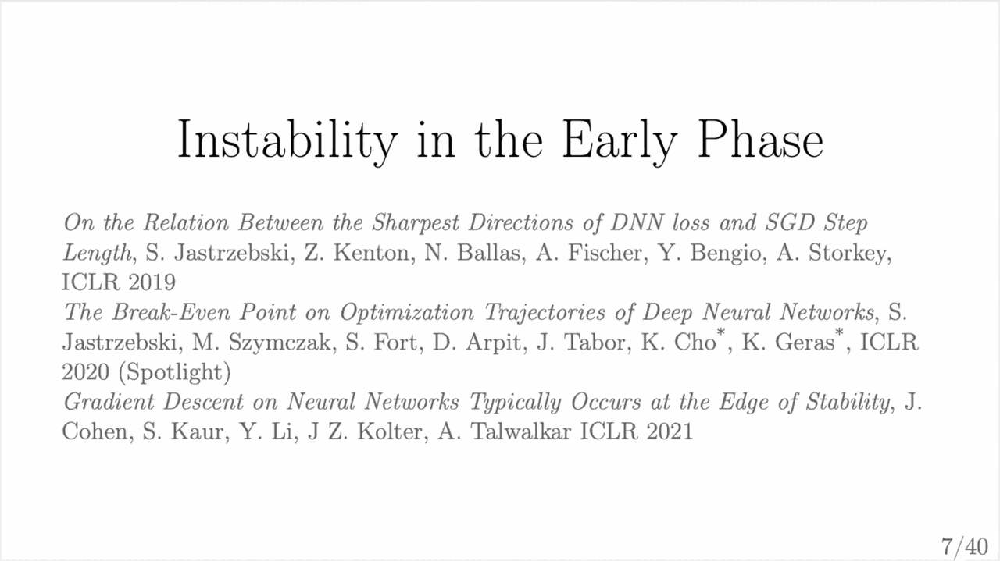
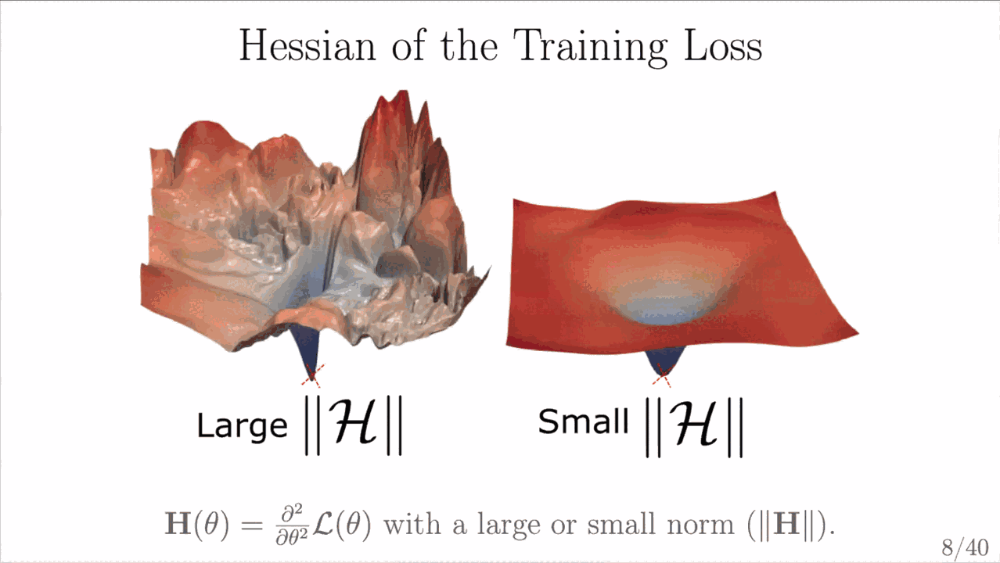
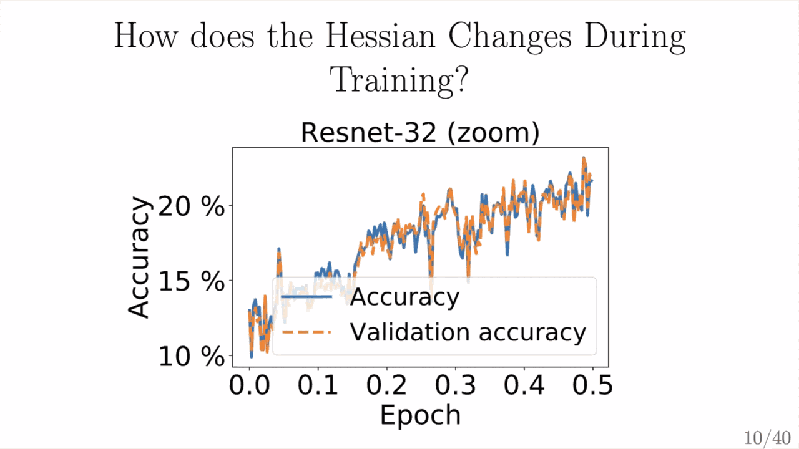
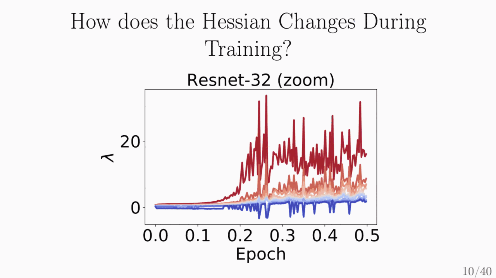
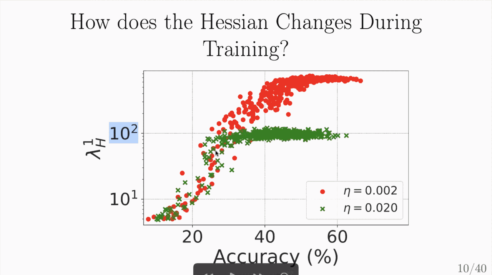
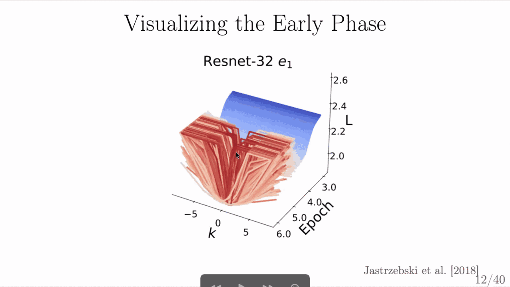
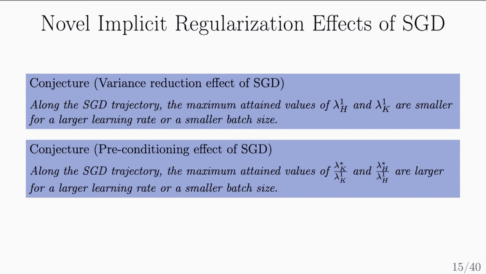
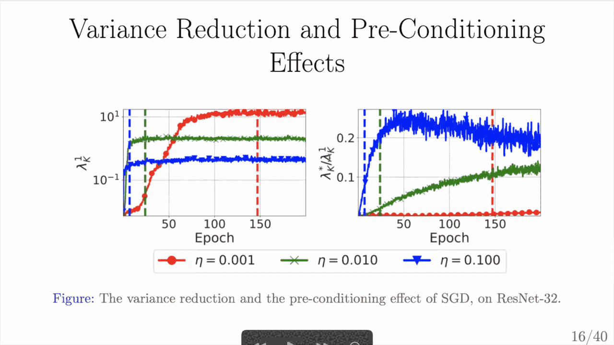

# Reverse-engineering implicit regularization due to large learning rates in deep learning

September 17, 2021
<https://rosanneliu.com/dlctfs/dlct_210917.pdf>

*Learning rate is typically scaled 0.1x per 50 epochs.*

*Small Hessian at initialization by design; Hessian then hovers around 20 (asymptote)?*

*Y-axis is the spectral norm of the Hessian.*

*As cross-entropy loss decreases from ~2.3 (for CIFAR10). At the beginning, we have picked the learning rate well—the optimization doesn’t diverge at the beginning, but the learning rate does not fit the curvature at the end.*

*Right plot is largest/smallest eigenvalue.*
