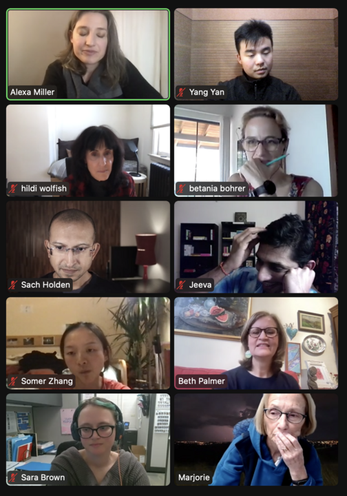

# The Joy of Looking: Collisions with Visual Art and Collective Perspectives

February 4, 2022
<https://interintellect.com/series/the-joy-of-looking-collisions-with-visual-art-and-collective-perspectives-with-alexa-miller/>

> Exposure to art over time is the only way to develop aesthetic understanding.
>
> Abigail Housen, Ph. D.

> Give people the opportunity to talk about things that matter to them.
>
> Philip Yenawine

Art gallery exploration: <https://docs.google.com/presentation/d/1aZoVS5Sj0MTVh5-BsXHjbFwNm8Rv6_z2/edit#slide=id.p6>.

Visual thinking strategy (VTS) elements:

* a clear starting/expectations
* carefully selected images
* peer groups
* silent looking
* questions
  * What’s happening in this picture?
  * What do you see that makes you say that?
  * What more can you/we find?
* listening
* pointing
* paraphrasing
* linking
* neutrality
* conditional language
  * “You *could be* saying this,” allowing you to externalize it, and move it around.
* concluding

Very much influenced by Gestalt school of visual analysis.
Recommend attending VTS Look Club: <https://vtshome.org/calendar/event/a164P00000Du0mNQAR/>.
