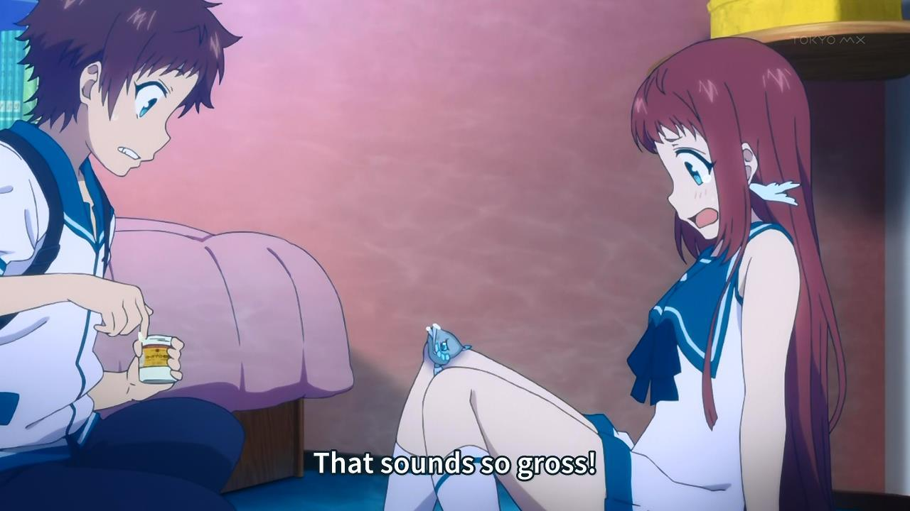

<!-- emilia-snapshot-properties
2D recurrences and combinatorial arguments
2022/12/21
utulek
emilia-snapshot-properties -->

# 2D recurrences and combinatorial arguments

December 21, 2022
Útulek Series, 1 | CF1761D Chapter, 1

[Codeforces 1761D](https://codeforces.com/contest/1761/problem/D) has been sitting in my head since it was proposed around a month ago.

> Consider two $N$-bit binary integers, $X,Y$. Let $f(X,Y)$ be the number of *carries* that occur during the addition of $X$ and $Y$. For example,
>
> $$\begin{aligned} &\begin{array}{r} 1_{\ \ }1_{\ \ }1\\ +\ _{1}1_{\ \ }0_{\ \ }0\\ \hline \ 1_{\ \ }0_{\ \ }1_{\ \ }1 \end{array} &\begin{array}{r} \ 1_{\ \ }0_{\ \ }1\\ +\ _{\ \ }0_{\ \ }0_{1}1\\ \hline \ 0_{\ \ }1_{\ \ }1_{\ \ }0 \end{array} & &\begin{array}{r} \ 1_{\ \ }0_{\ \ }1\\ +\ _{1}0_{1}1_{1}1\\ \hline \ 1_{\ \ }0_{\ \ }0_{\ \ }0 \end{array} \end{aligned}$$
>
> So $f(7,4)=1,f(5,1)=1$, and $f(5,3)=3$.
>
> For a given $K\leq N$, find $A_{N,K}$, the number of ordered pairs $(X,Y)$ such that $f(X, Y) = K$. For example, for $N=3,K=1$, $A_{3,1}=15$, as the set of ordered pairs is $(1,1)$, $(1,5)$, $(2,2)$, $(2,3)$, $(3,2)$, $(4,4)$, $(4,5)$, $(4,6)$, $(4,7)$, $(5,1)$, $(5,4)$, $(5,6)$, $(6,4)$, $(6,5)$, $(7,4)$, each of which sees exactly one carry during their addition.
>
> For limits, we have $0\leq K<N\leq 1e6$, so anything not $O(N\ln{N})$ is pushing it.

As Wyatt pointed out, the sponsors of the round, the EZEC team at Pinely, also have a very cute mascot in EZEC-chan!

*Pinely $\approx$ Rentec > HRT $\approx$ Jane. $\blacksquare$*

It must bring EZEC-chan great disappointment, then, that I wasn’t able to solve 1761D in-contest. Inspired by Wyatt’s deeper (and most of the time, number theoretical) dives into solving problems, such as [1748D](https://codeforces.com/contest/1748/problem/D), and learning the theory behind them, I attempt the same here—which, more concretely, means exploring everything remotely related and at least somewhat accessible to a (mostly) elementary mathematician. Hence, this “1761D chapter” of blogposts will hopefully cover a lot of ground, from Pell equations and generating functions, to the Taylor series, linear sieve, and Number Theoretic Transform (NTT). Unfortunately, I don’t know much complex analysis yet, so I’ll try to avoid getting in the weeds where possible.

## 1 Reduction to Recurrence

I begin each problem with an attempt to find the correct *subproblem structure*—that is, a method to compose solutions to smaller subproblems into a solution to a larger subproblem. Trivially, this must exist for any problem solvable with dynamic programming (DP) , but I argue that it exists for any algorithmic problem—the loops themselves establish the sequential subproblems to be solved. For example, in [Linear Max Gap](http://gilgamesh.cc/snapshots/linear-max-gap), I would retroactively argue that two series of subproblems exist: first, the subproblems of finding the range $K=A_{max}-A_{min}$, and secondly, the subproblems of partitioning $A_i$ and finding the max gap for each of the bucket prefixes $\{B_1,\ldots,B_i\}$.

Playing with small examples, I have discovered, is a decent way to sniff out subproblem structure. We have for the $1$-bit numbers

$$\begin{aligned}
A_{1,0}&=|\{(0,0),(0,1),(1,0)\}|=3,\\
A_{1,1}&=|\{(1,1)\}|=1\text{ (with a carry)}.
\end{aligned}$$

It makes sense to consider whether the leading bit carries as part of the subproblem, as that obviously affects the number of carries when we consider the next bit. Let $B_{N,K},C_{N,K}$ denote the number of ordered pairs of $N$ bits whose addition shows $K$ carries, but with the leading, most significant bit not carried and carried, respectively. We then have $A_{N,K}=B_{N,K}+C_{N,K}$, and, considering the $2$-bit numbers, we have

$$\begin{aligned}
B_{2,0}&=|\{(00,00),(00,01),(00,10),\\
&(00,11),(01,00),(01,10),\\
&(10,00),(10,01),(11,00)\}|=9,\\
C_{2,0}&=0,\\
\implies A_{2,0}&=9,\\
B_{2,1}&=|\{(01,01)\}|=1,\\
C_{2,1}&=|\{(10,10),(10,11),(11,10)\}|=3,\\
\implies A_{2,1}&=4\\
B_{2,2}&=0,\\
C_{2,2}&=|\{(01,11),(11,01),(11,11)\}|=3,\\
\implies A_{2,2}&=3.
\end{aligned}$$

Thus, the subproblems to consider for 1761D $A_{N,K}$, are those of finding $B_{i,j},C_{i,j}$ for $i\leq N,j\leq K$. The structure, then, is that for $A_{i,j}$, either $0$ or $1$ carries can occur in the $i$-th bit, and the remaining $j$ or $j-1$ carries must occur in the less significant $i-1$ bits. Hence,

$$A_{i,j}=f(B_{i-1,j},C_{i-1,j},B_{i-1,j-1},C_{i-1,j-1})$$

and it is our mission to find $f$. Intuitively, $f$ is linear, as each of $B_{i-1,j},C_{i-1,j},B_{i-1,j-1},C_{i-1,j-1}$ should be involved in $A_{i,j}$ a constant number of times, based on the bits we select for the $i$-th position. Considering the $4$ ordered bit pairs possible for the $i$-th position, we have

$$\begin{aligned}
A_{i,j}&=3B_{i-1,j}\text{ for bit pairs }(0,0),(0,1),(1,0)\\
&+1C_{i-1,j}\text{ for bit pair }(0,0)\\
&+1B_{i-1,j-1}\text{ for bit pair }(1,1\\
&+3C_{i-1,j-1}\text{ for bit pairs }(0,1),(1,0),(1,1).
\end{aligned}$$

We actually need a finer breakdown of $A_{i,j}$ into $B_{i,j}$ and $C_{i,j}$, but it is not so difficult to use the same casework we have used already to find this:

$$\begin{aligned}
B_{i,j}&=3B_{i-1,j}\text{ for bit pairs }(0,0),(0,1),(1,0)\\
&+1C_{i-1,j}\text{ for bit pair }(0,0),\\
C_{i,j}&=1B_{i-1,j-1}\text{ for bit pair }(1,1),\\
&+3C_{i-1,j-1}\text{ for bit pairs }(0,1),(1,0),(1,1).
\end{aligned}$$

This I deem a twin two-dimensional recurrence—but I suspect all twin (and likely higher orders) two-dimensional recurrences can be simplified into single two-dimensional recurrences via repeated substitution, as I discovered in-contest. This smells a little like matrices, and we may have to revisit this later on.

$$\begin{aligned}
B_{i,j}&=3B_{i-1,j}+1C_{i-1,j}\\
&=3B_{i-1,j}+B_{i-2,j-1}+3C_{i-1,j-1}\\
&=3B_{i-1,j}+B_{i-2,j-1}+3B_{i-2,j-2}+9C_{i-2,j-2}\\
&=3B_{i-1,j}+B_{i-2,j-1}+(3B_{i-2,j-2}+9B_{i-3,j-3}+9C_{i-3,j-3}+\ldots)\\
&=3B_{i-1,j}+B_{i-2,j-1}+(3B_{i-1,j-1}-9B_{i-2,j-1})\\
&=3B_{i-1,j}+3B_{i-1,j-1}-8B{i-2,j}
\end{aligned}$$

for some initial conditions we will determine later. Similarly,

$$C_{i,j}=3C_{i-1,j}+3C_{i-1,j-1}-8C_{i-2,j}$$

which is frankly quite nice. As $A_{i,j}=B_{i,j}+C_{i,j}$, we have then the very simple reduction to

$$A_{i,j}=3A_{i-1,j}+3A_{i-1,j-1}-8A_{i-1,j-2}\tag{1.1}$$

which gives our titular recurrence. We can determine initial conditions by playing around with the small values; this gives us $A_{i,0}=3^i$ for $i\geq 0$ and $A_{i,i}=3^{i-1}$ for $i\geq 1$. As $A_{i,j}$ is a two-dimensional recurrence, we may visualize it in a Pascal’s triangle-like manner:

$$\begin{matrix}
1\\
3&1\\
9&4&3\\
27&15&13&9\\
81&54&52&42&27\\
\ldots
\end{matrix}\tag{1.2}$$

with $0$-indexed rows and columns, and $A_{N,K}$ at row $N$ and column $K$. Indeed, $A_{3,1}=15$, and the sum of each row is a power of two—as the number of ordered pairs of $N$-bit numbers is $2^{2N}$.

It’s unfortunately at this point in-contest that I failed to make any additional progress. Naively, computing $A_{N,K}$ can be accomplished in $\Theta(NK)$ via $(1.1)$, but this is too slow. Recall that the Fibonacci sequence

$$S_i=S_{i-1}+S_{i-2}$$

which is naively computed in $\Theta(N)$ (similarly via memoization), can also be computed in $\Theta(\ln N)$ via repeated squaring of its matrix:

$$\begin{bmatrix}
S_2&S_1\\
S_1&S_0
\end{bmatrix}^i=\begin{bmatrix}
1&1\\
1&0
\end{bmatrix}^i=\begin{bmatrix}
S_{i+1}&S_i\\
S_i&S_{i-1}
\end{bmatrix}\tag{1.3}$$

or equivalently via $O(\ln N)$ repeated squaring of the exponents in Binet’s formula

$$S_i=\frac{1}{\sqrt{5}}((\frac{1+\sqrt{5}}{2})^i	-(\frac{1-\sqrt{5}}{2})^i)$$

under assumption of arbitrary precision arithmetic, which is typically an invalid assumption.

I will note, however, that the set of numbers $F_{\sqrt{i}}=a+b\sqrt{i}$, with $a,b,i\in\mathbb{Q}$, is closed under addition, subtraction, multiplication, and division, and is more generally a field. It must also be that all intermediate operations in computing $S_i$ involve numbers from $F_{\sqrt{5}}$. I suppose $F_{\sqrt{i}}$ must have a common name, but I am not aware of it. I will further hypothesize that the $a,b$ involved in the operations to compute Binet’s formula likely have simplified numerators and denominators of size $\Theta(5^{N/2})$ based on the following examples:

$$\begin{aligned}
(1+\sqrt{5})^2&=6+2\sqrt{5},\\
(1+\sqrt{5})^3&=16+8\sqrt{5},\\
(1+\sqrt{5})^3&=56+24\sqrt{5},
\end{aligned}$$

thus rendering the traditional $\Theta(\ln N)$ repeated squaring on Binet’s to actually be $\Theta(N\ln N)$ with the extra $\Theta(N)$ factor coming from dealing with numbers which take $\Theta(N)$ bits to represent in memory.

I must also address here that my runtimes are typically stated in reference to $N$ as the *value* of the input, rather than the *size* (number of bits) of the input, which is typically $\log$-size of the value. Some algorithms, such as the vEB tree, are more concisely interpreted with a runtime in terms of the input *size*, but will primarily not be dealing with those sorts of algorithms.

Anyway, solution $(1.3)$ to the one-dimensional Fibonacci recurrence is a glimmer of hope that two-dimensional recurrence $(1.1)$ can be solved in $O(N\ln N)$, or, even better, in $\Theta(N)$ or $\Theta(\ln N)$. However, I was not able to come up with such a solution in-contest.

## 2 Combinatorial Intuition

Tony and I collaborated on a combinatorial solution after the contest. I will hereby put forth the (perhaps yet immature) hypothesis that the subproblem structure discovered by an attempt is largely determined by the initial examples that one plays with—in the same way that a neural network classifier may be largely determined by the initial seed. Anyway, consider the following initial seed:

$$\begin{array}{r}
\ 1_\ \ 0_\ \ 1\ \ 0 \ \ 0\ \ \ 1\ \ 1\\
+\ _1\ \ 0_1\  1_11\ \ 1\ \ 0_1\ 0_1\ 1\\
\hline
\ 1_\ \ \ 0_\ \ 0_\ \ 0\ \ 1\ \ \ 1\ \ 0\ \ 1
\end{array}.\tag{2.1}$$

This example stinks of the same subproblem structure as in section $(1)$. I explain below.

When we add a most significant bit to each of the above $7$-bit numbers (hence forming a pair of most significant bits), we see a new carry iff the bit pair is $(0,1),(1,0)$, or $(1,1)$. Similarly, if the leading bit were not carried, we would not see a new carry iff the bit pair is $(0,0),(0,1)$, or $(1,1)$. This observation, that whether or not the $i+1$-th bit carries only depends on the carry status of the $i$-th bit, is a case of *state space simplification*. That is, the carry status of the $1\ldots i-1$ bits doesn’t influence whether or not the $i+1$-th bit carries. So, when we move from considering the $i$-th bit to considering the $i+1$-th bit, we don’t have to store $\Theta(N)$ information in our state, but only $\Theta(1)$ information.

$\Theta(1)$ state information is the best one can ask for—so, if we were to consider the states and subproblems as the sum operations of two $i$-bit numbers for $i\leq N$, then we process $\Theta(N)$ state information in total, which is within our runtime bounds. This suggests that this subproblem structure is a promising approach. However, attempting a DP solution from this point lands us back with recurrence $(1.1)$, which suggests that there are additional simplifications to be made. Indeed, the example $(2.1)$ is much longer than the examples we used in section $(1)$, and lends itself to additional insights.

Let’s continue with example $(2.1)$. We can represent the carry status of the addition operation of two $7$-bit integers as the following $8$-bit string representation:

$$\begin{matrix}
0&1&1&1&0&0&1&1
\end{matrix}\tag{2.2}$$

At this point, this problem smells like the *string runs* simplification. I will explain below.

Three of the four choices of bit pairs for the $i+1$-th bit always continues the carry status of the $i$-th bit, and one choice always flips the carry status. How many ordered pairs $(x_1,x_2)$ generate carry status string like representation $(2.2)$?

The carry status always starts out at $0$, so one flip will need to be made at index $0$. Then, two indices later, another flip, and two indices later, another flip. The final flip occurs at index $6$:

$$\begin{matrix}
0&1&1&1&0&0&1&1\\
\^{}&&&\^{}&&\^{}&&\^{}
\end{matrix}.\tag{2.3}$$

These four flips only have one choice each for the bit pair at their index. Indeed, in $(x_1,x_2)$, the flips to carry status $0$ necessarily have the bit pair $(0,0)$ at that index, and the flips to carry status $1$ necessarily have the bit pair $(1,1)$ at that index:

$$\begin{matrix}
&1&0&1&0&0&1&1\\
&0&1&1&1&0&0&1\\
\^{}&&&\^{}&&\^{}&&\^{}
\end{matrix}.$$

So, to create representation $(2.2)$ there are $1^4$ choices for the four flips, and $3^4$ choices for the four non-flip indices, for a total of $81$ ordered pairs of $(x_1,y_1)$. This is a nice result! We can stop here and, with some work, derive a nice $\Theta(N)$ closed form for $A_{N,K}$, but another *state space simplification* is possible to make that work easier.

With the carry status string representation in $(2.2)$, we can derive the number of carries $K$ from the string which has $N$ bits of information. I’ve come to find that the *bits* of information in a representation is a poor heuristic for the ability of a representation to be further simplified—in fact, the count of *objects* in a representation is typically a better heuristic. Still, representation $(2.2)$ has $N$ objects of information. Representation $(2.3)$ transforms this $N$-bit number into $|\text{flips}|$ numbers each representing the number of bits before the next flip. This is $|\text{flips}|$ objects, which is always less than, and better than $N$ objects.

Finally, since we only care about the number of carries, we need only store the information about the lengths of the $1$-carry-status runs, which is a total of $|\text{1-runs}|$ objects of information! This gives the following *string runs* representation of example $(2.1)$:

$$2,3\tag{2.4}$$

where the $2$ denotes the run of 1-carry-statuses in indices $0$ through $1$, and the $3$ denotes the run of 1-carry-statuses in indices $4$ through $6$. Indeed, $2+3=5$ carries as we saw in example $(2.1)$.

The *string runs* representation is generally pretty powerful, and I’ve seen it many times before, most recently in [1767C](https://codeforces.com/contest/1767/problem/C). There, again, we have binary strings which can be simplified into runs, and furthermore, only the final run matters, lending itself to yet another state space simplification.

Now we’re in the home stretch, which unfortunately is a ton of precise combinatorics. I always find combinatorial solutions difficult to follow unless I work through them myself, and unfortunately I don’t think I’ve done a good enough job here that this isn’t the case.

Taking our state as the runs representation in $(2.4)$, we must ask next: how many $(x_1,x_2)$ correspond with each representation? For $r$ runs ($r=2$ in $(2.4)$), we must have $2r$ flips ($2r=4$ in $(2.3)$), which leads to $3^{N-2r}$ *or* $3^{N-2r+1}$ possible choices of $(x_1,x_2)$ which generate the flips representation in $(2.3)$. The off-by-one difference is due to the position of the final flip—if it is in bit $N+1$, it frees up an additional bit in the first $N$ bits for which we have $3$ choices.

As discussed, string run representation $(2.4)$ contains slightly less information, and thus we expect even more ordered pairs to generate the same representation. Indeed, we no longer know the positions of the $0$-carry-status bits, of which there are $3$. We must somehow first place the $2$ runs in with the $3$ $0$-carry-status bits, and then scale by either $3^{N-2r}$ or $3^{N-2r+1}$.

Smell something? Yeah, that’s ~~America~~ stars and bars (twice-fold).

*Please stop asking if I receive unemployment benefits.*

Supposing we wanted $K\geq 0$ carries, then, it suffices first to consider the number of runs we use:

$$\sum_{i=1}^K$$

and for each selection of runs, their positioning with the $0$-carry-status bits:

$$\sum_{i=1}^K{N-K+1\choose i}$$

and how those $K$ carry status bits are distributed among the $i$ runs:

$$\sum_{i=1}^K{{N-K+1\choose i}{K-1\choose i-1}}$$

and finally the $N-2i$ or $N-2i+1$ bits which have $3$ choices each. Recall that the $N-2i+1$ case only arises if the final run also includes the final, most significant bit, which leaves $N-K\choose i-1$ run positions which generate this case:

$$
A_{N,K}\text{ for }K\geq 1=\\
\sum_{i=1}^K{(3^{N-2i}{N-K\choose i}+3^{N-2i+1}{N-K\choose i-1}){K-1\choose i-1}}.
$$

Indeed, we have in accordance with $(1.2)$,

$$A_{3,1}=(3{2\choose 1}+9{2\choose 0}){0\choose 0}=15.$$

$$A_{3,2}=(3{1\choose 1}+9{1\choose 0}){1\choose 0}+(0+1{1\choose1}){1\choose 1}=13.$$

We can also re-index to not use the number of runs, but instead the number of non-leading flips:

$$A_{N,K}=\sum_{j=1}^{2K}{3^{N-j}{N-K\choose \lfloor j/2\rfloor}{K-1\choose \lceil j/2\rceil-1}}.\tag{2.5}$$

Admittedly, there is an edge case where $2i>N$ as seen in $A_{3,2}$, which must set $3^{N-2i}$ as $0$. Otherwise, this is a pretty straightforward implementation. The answer may be large, so we are asked to mod by the prime $1e9+7$. The factorials up to $N$ can be memoized in $\Theta(N)$, and their inverses naively memoized in $\Theta(N\ln N)$. Queries are then $\Theta(K)$ to compute the $K$-term summation, leading to a $\Theta(K+N\ln N)$ solution.

[$\Theta(K+N\ln N)$ Codeforces submission](https://codeforces.com/contest/1761/submission/186298003).

The extra $\Theta(\ln N)$ factor feels unneeded—indeed, there is an optimization to memoize the factorial inverses in $\Theta(N)$: by starting with $1/N!$, and multiplying down: [$\Theta(N)$ Codeforces submission](https://codeforces.com/contest/1761/submission/186300108), which is almost 10 times as fast! This also implies that we can find the first $N$ multiplicative inverses in $\Theta(N)$, which is indeed the case as explained in [this comment by mnaeraxr](https://codeforces.com/blog/entry/16524?#comment-415976) and in an alternate form in [this comment by it4.kp](https://codeforces.com/blog/entry/5457?#comment-106714).

The important thing here, of course, isn’t the specifics of the combinatorial argument which landed us at $(2.5)$, but rather the form of $(2.5)$. Evidently, it must be the same solution which solves recurrence $(1.1)$, which, upon retrospection, would have been difficult to derive in-contest.

## 3 Smells Fishy

So, at this point, if the smoke detector isn’t going off, it ought to be replaced. The room is absolutely pungent of something fishy, and frankly, I’m quite the fan of mermaids.

*Symbolism.*

Here’s why. Recall Pascal’s triangle, the classical two-dimensional recurrence:

$$\begin{matrix}
1\\
1&1\\
1&2&1\\
1&3&3&1\\
1&4&6&4&1\\
\ldots
\end{matrix}$$

with well-known solution $T_{i,j}=T_{i-1,j}+T_{i-1,j-1}={i\choose j}$. Is it a coincidence, that $T_{i,j}$, like the solution to $A_{i,j}$ derived in $(2.5)$, both contain choose expressions (and optionally, the sum of many choose expressions)?

$$\begin{aligned}
A_{i,j}&=3A_{i-1,j}+3A_{i-1,j-1}-8A_{i-1,j-2}\\
&=\sum_{k=1}^{2j}{3^{i-k}{i-j\choose \lfloor k/2\rfloor}{j-1\choose \lceil k/2\rceil-1}}.
\end{aligned}$$

Recall that Binet’s formula for the Fibonacci numbers is of the form

$$S_i=(\text{some radical})(\text{some radical})^i+(\text{some radical})(\text{some radical})^i$$

so perhaps it is not so surprising to learn that the solution to the tribonacci numbers $T_i=T_{i-1}+T_{i-2}+T_{i-3}$ is of the form

$$\begin{aligned}
T_i&=(\text{some radical})(\text{some radical})^i\\
&+(\text{some radical})(\text{some radical})^i\\
&+(\text{some radical})(\text{some radical})^i
\end{aligned}.$$

Anyway, I’m going to take a small detour to introduce a problem I read in Mosteller’s Fifty Challenging Problems in Probability:

> A drawer contains red socks and black socks. When two socks are drawn at random (without replacement), the probably that both are red is $1/2$. How many socks can the drawer contain?

I promise this detour does tie back into 1761D. However, that will have to wait until next time.
