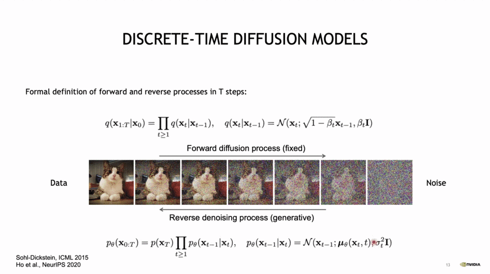
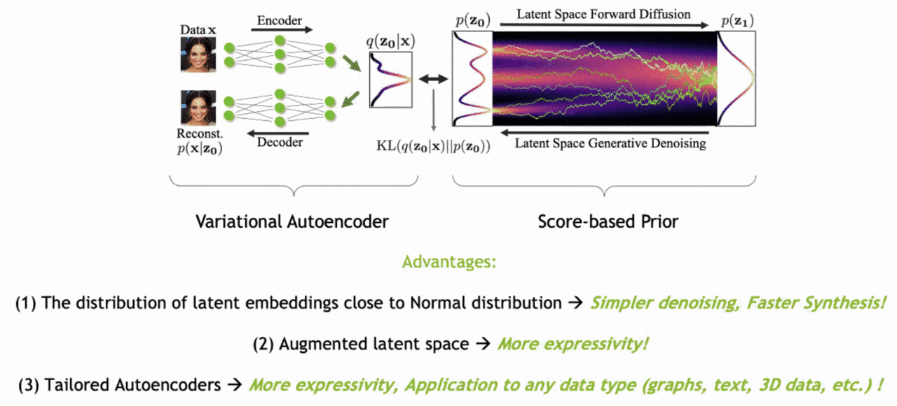
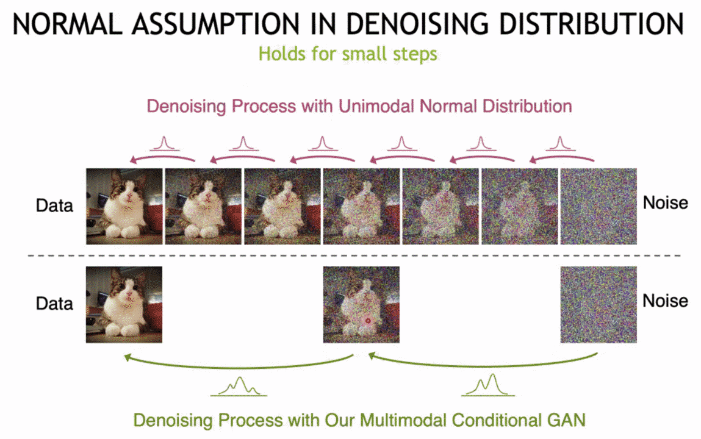
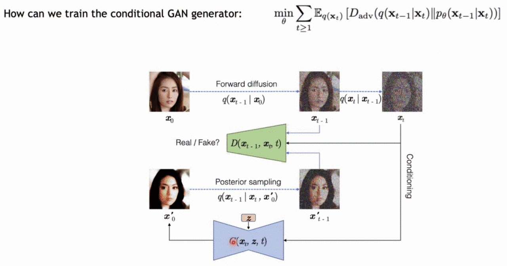

# Tackling the Generative Learning Trilemma with Accelerated Diffusion Models

February 5, 2022
<https://rosanneliu.com/dlctfs/dlct_220204.pdf>

Denoising distribution is only normal if we assume time-step is small.

