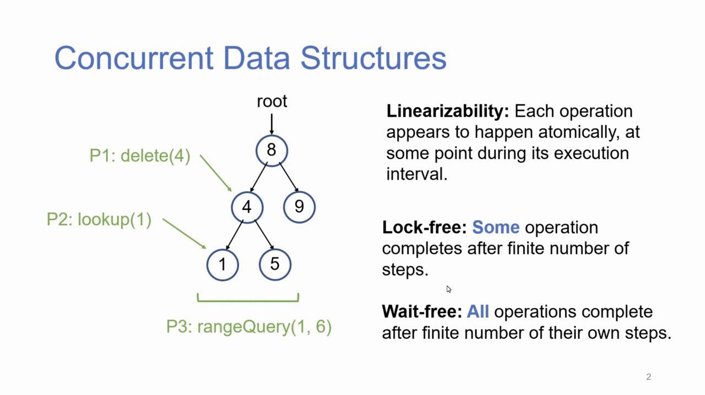
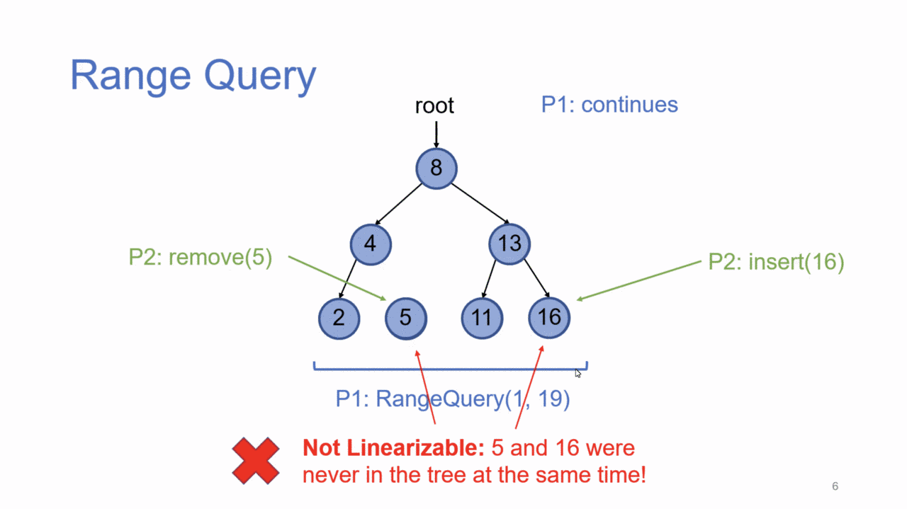
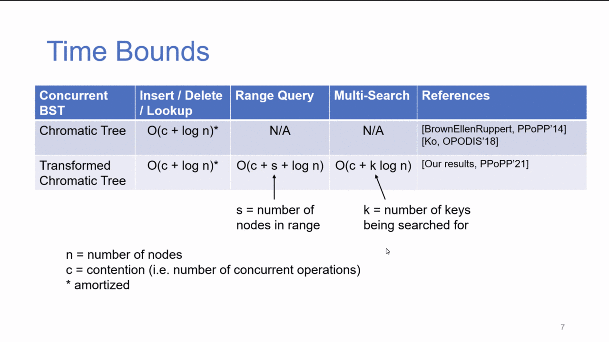
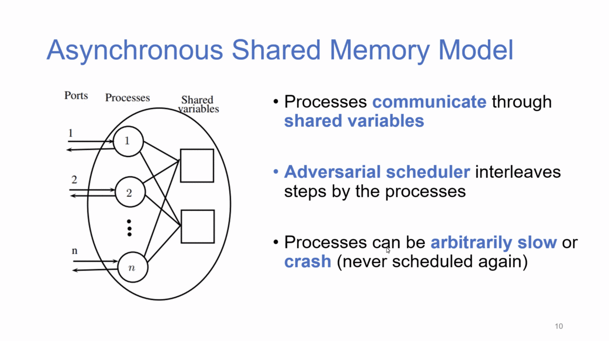
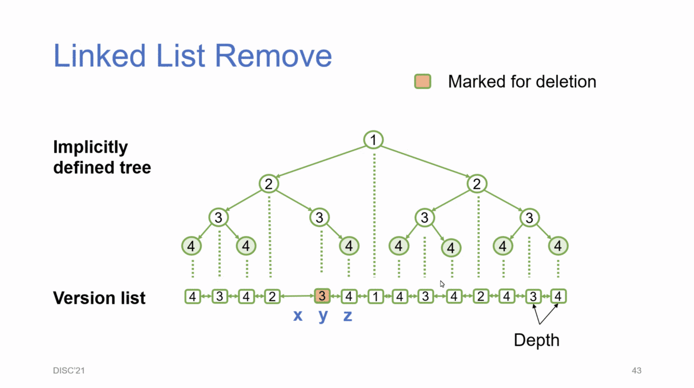

# Concurrent Datastructure Techniques for Multi-Point Queries

December 8, 2021
<http://s.gilgamesh.cc/29>

* Single-point vs. multi-point queries.

*Linearizability is violated.*

* Compare & Swap (CAS) operation very important in model.
